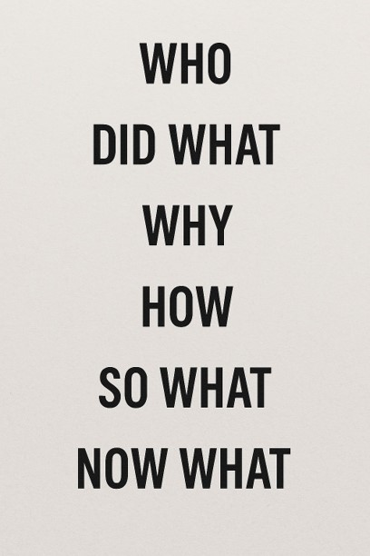

## Incident Reporting & Communication Framework: 
# *"Who Did What, Why & How, So What, Now What"*
<blockquote> This communication model is adapted from reflective and storytelling frameworks used in education, healthcare, and leadership. It helps responders structure clear, audience-tailored summaries during incident response reporting. </blockquote>

---

---

## Attribution
This framework is inspired by:
- **"Somebody Wanted But So" (SWBS) strategy** -  widwly used in education to help students summarize, originator is not well-documented
- **Borton's Developmental Model (1970)** – "What? So What? Now What?"
- **Driscoll's Model of Reflection**
- **Rolfe et al.'s Reflective Model (2001)**

These models were developed to promote reflection and critical thinking and have been adapted here for incident responders.

---

## Framework Overview

| **Component** | **Explanation** | **Tips for Use** |
|---------------|-----------------|------------------|
| **Who**       | Who was involved (attacker, insider, external actor) | Use generic terms for non-technical audiences |
| **Did What**  | What action they took (e.g., phishing, exfiltration) | Focus on the behavior, not just the alert |
| **Why**       | Likely motivation (e.g., access data, install malware) | Make intent relatable: theft, disruption, etc. |
| **How**       | TTPs, entry points, tools used | For technical peers, relate known ATPs, TTPs, etc. |
| **So What**   | Impact or risk posed | Emphasize business impact, compliance, downtime |
| **Now What**  | Actions taken or recommended | Show containment, response, and future steps |

---

## Audience-Specific Examples

### 1. Technical Peers (In-progress)

> **Who:** An external attacker leveraging credential stuffing techniques  
> **Did What:** They launched an automated login attack against our VPN portal  
> **Why:** The goal was most likely to find a valid account with access to internal systems  
> **How:** They used a scripted tool to send login requests from multiple IPs  
> **So What:** Most attempts failed, but one account had their first factor compromised before it was locked  
> **Now What:** We’ve blocked the source IPs, reset credentials, and are reviewing logs for any other unusual activity  

---

### 2. Mixed Audience (Technical + Non-Technical) with Clarifications (In-progress)

> **Who:** An external attacker leveraging credential stuffing techniques — (which means they tried lots of usernames and passwords from previous breaches to see if any still worked).  
> **Did What:** They launched an automated login attack against our VPN portal — (that is when they use a bot rapidly entered credentials into our remote access system).  
> **Why:** The goal was most likely to find a valid account with access to internal systems — (in other words, they wanted a backdoor into our network).  
> **How:** They used a scripted tool to send login requests from multiple IPs — (this helps them avoid detection and try as many combos as possible).  
> **So What:** Most attempts failed, but one account had a successful login before it was locked — (this could have allowed them to move further into the network if we hadn’t caught it).  
> **Now What:** Now What: We’ve blocked the source IPs, reset credentials, and are reviewing logs for any other unusual activity — (in other words, we’re locking down what they touched and we'll keep checking for signs of compromise).  

---

### 3. Executive Leadership / Board (In-progress)

> **Who:** An external threat actor targeted (Company Name/Department/User(s)).  
> **Did What:** They launched a phishing campaign to steal credentials.   
> **Why:** Likely to access sensitive internal systems and data.   
> **How:** Used a professional-looking fake login page.   
> **So What:** A successful compromise could've led to data exfiltration and financial loss.   
> **Now What:** The threat was detected early; accounts were secured; ongoing monitoring in place.  

---

### 4. Legal/Compliance (In-progress)

> **Who:** Unknown external actor   
> **Did What:** Attempted unauthorized access via phishing   
> **Why:** Potential motive includes data theft or regulatory impact   
> **How:** Phishing email bypassed spam filter; linked to spoofed login   
> **So What:** No confirmed data breach, but access attempt to regulated data zone   
> **Now What:** Reviewed DLP logs, documented in case register, issued internal memo  

---

### 5. Non-Technical Colleagues (In-progress)

> **Who:** A cybercriminal tried to target our company   
> **Did What:** They sent fake emails impersonating another company  
> **Why:** To trick someone into providing their their login information   
> **How:** Linked to a site that looked like our login page   
> **So What:** No one fell for it, but it could have been serious   
> **Now What:** We blocked the site and are sending reminders to stay alert  

---

### 6. Public Relations (PR) (In-progress)

> **Who:**  
> **Did What:**  
> **Why:**  
> **How:**   
> **So What:**  
> **Now What:**  

---

### 7. Human Resources (Insider Threat) (In-progress)

> **Who:** A current employee with elevated access privileges   
> **Did What:** Attempted to download large quantities of internal documents to a personal device   
> **Why:** Under investigation for potential policy violation or preparing to exit the company   
> **How:** Used legitimate credentials and tools outside of normal business hours   
> **So What:** Potential violation of company policy and data protection rules; risk of intellectual property loss   
> **Now What:** Account access restricted, HR notified, internal investigation initiated, documentation prepared for possible disciplinary action  

---

## Tips for Use

- Tailor the **depth of technical detail** based on the audience
- Use the **"So What"** section to connect the incident to real business consequences
- Keep **"Now What"** action-focused to reassure stakeholders
- Consider **visuals or diagrams** for executive, PR, and HR audiences

---

*Prepared by: Martha Sosa  
Inspired by foundational communication and reflection models and brilliant teachers everywhere*
